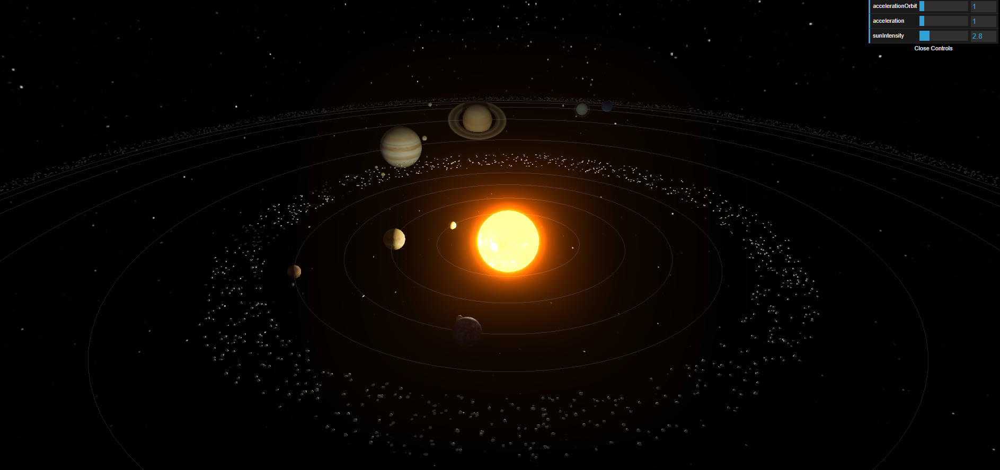
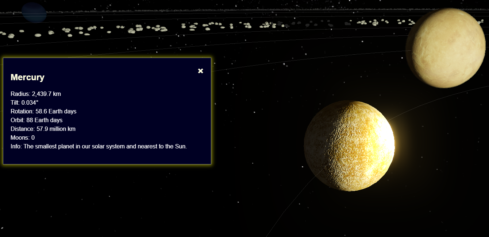
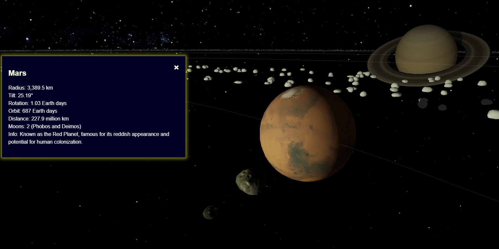

# 3D Solar System in THREE.js

Welcome to the **3D Solar System** project, a dynamic and interactive simulation of our solar system created using THREE.js and the Vite framework. This project showcases various advanced features and effects to provide an immersive experience of the celestial bodies in our solar system.

_Features_

Scene, Camera, Renderer: I used THREE.js to set up the basic scene so I could start showing 3D objects.

Controls: Added orbit controls so I could move around the 3D view with my mouse.

Texture Loading: Learned how to load planet and moon textures to make them look more realistic.

_Visual Effects_
Bloom Effect: I added a glow to the Sun using a bloom effect, which makes it stand out.

Outline Effect: When you hover over a planet, a white outline shows up—this was done using OutlinePass.

Composer: I used EffectComposer to combine and manage the visual effects in the scene.

_Star Background_
I added a starry background image so the solar system has a space-like feel.

_Sliders and Settings_
dat.GUI: Added sliders to change settings like orbit speed and the Sun’s glow so I could test things easily.

_Lights_
AmbientLight: This gives soft light to the whole scene.

PointLight: Placed in the middle of the Sun so shadows look more realistic.

_Planets and Moons_
Planet Details: I gave each planet some details like size, position, and texture. Some even have bump maps and rings.

Moons: I added moons to some planets, and they rotate too.

Earth Shader: I tried using a shader on Earth to show day/night changes and moving clouds.

Phobos and Deimos: Instead of using spheres, I used 3D models to make Mars’s moons look more real.

_Orbits and Rotations_
All planets and moons rotate and orbit the Sun. I tried to scale the distances and sizes to look somewhat accurate, but I had to adjust some things to make it look better on screen.

_Shadows_
I enabled shadows so that planets and moons cast realistic shadows based on the Sun's light.

_Planet Interaction_
Hover: When you move your mouse over a planet, it shows a white outline.

Click Zoom: Clicking zooms into the planet and shows some info.

Zoom Out: You can click to close the info and return to the full solar system view.

_Resources_
I used free textures and models from these websites while building the project:

NASA 3D Resources

Solar System Scope Textures

TurboSquid

AI(Chatgpt)

## Installation and Setup

1. Navigate to the project directory:

   cd 3d-solar-system

2. Install dependencies:

   npm install

3. Start the development server:

   npm run dev

4. Open your browser and navigate to `http://localhost:3000` to see the 3D Solar System in action.

## Conclusion

This project is a comprehensive representation of our solar system, bringing together realistic modeling, advanced visual effects, and interactive features. Explore the planets, their moons, and the vast asteroid belts, all from the comfort of your screen.
